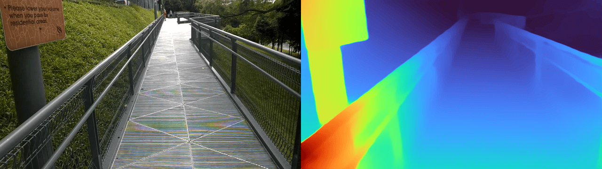
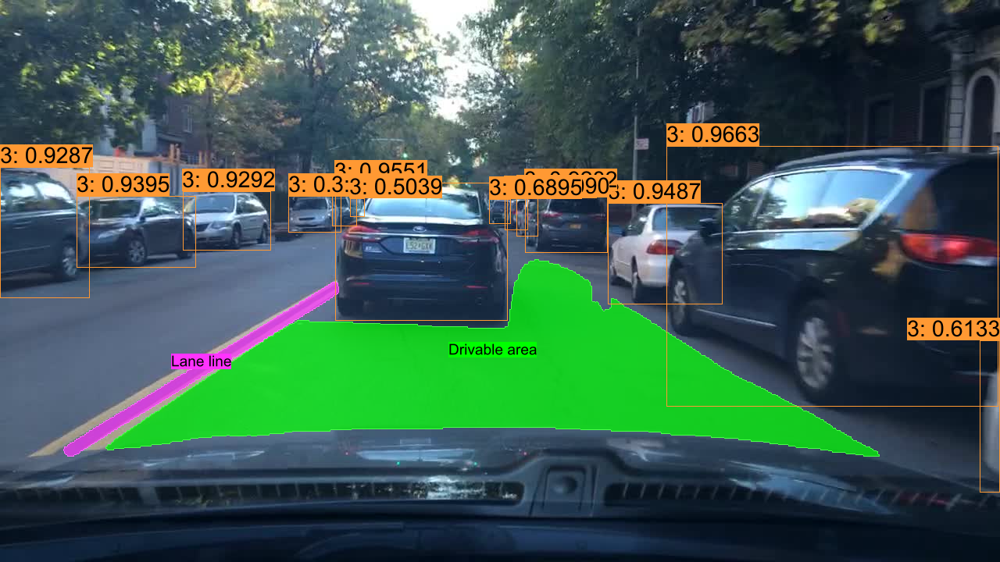
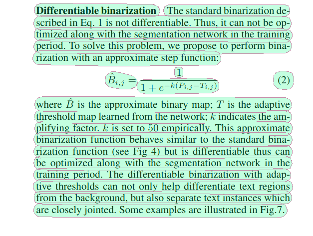
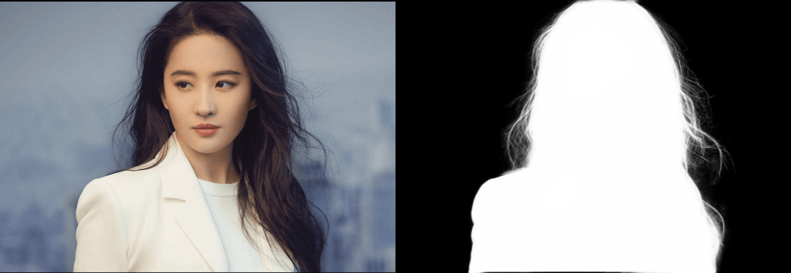

# usls

[](https://crates.io/crates/usls)  [](https://docs.rs/usls) [](https://github.com/jamjamjon/usls)

A Rust library integrated with **ONNXRuntime**, providing a collection of **Computer Vison** and **Vision-Language** models including [YOLOv5](https://github.com/ultralytics/yolov5), [YOLOv8](https://github.com/ultralytics/ultralytics), [YOLOv9](https://github.com/WongKinYiu/yolov9), [YOLOv10](https://github.com/THU-MIG/yolov10), [RTDETR](https://arxiv.org/abs/2304.08069), [CLIP](https://github.com/openai/CLIP), [DINOv2](https://github.com/facebookresearch/dinov2), [FastSAM](https://github.com/CASIA-IVA-Lab/FastSAM), [YOLO-World](https://github.com/AILab-CVC/YOLO-World), [BLIP](https://arxiv.org/abs/2201.12086), [PaddleOCR](https://github.com/PaddlePaddle/PaddleOCR), [Depth-Anything](https://github.com/LiheYoung/Depth-Anything), [MODNet](https://github.com/ZHKKKe/MODNet) and others.

|                          Monocular Depth Estimation              |
| :--------------------------------------------------------------: |
|  |


|                        Panoptic Driving Perception                        |    Text-Detection-Recognition   |
| :----------------------------------------------------: | :------------------------------------------------: |
|  |  |

|                     Portrait Matting                     |
| :------------------------------------------------------: |
|  |


## Supported Models

|                               Model                               |                                                      Task / Type                                                      |           Example           | CUDA<br />f32 | CUDA<br />f16 |     TensorRT<br />f32     |     TensorRT<br />f16     |
| :---------------------------------------------------------------: | :--------------------------------------------------------------------------------------------------------------------: | :--------------------------: | :-----------: | :-----------: | :------------------------: | :-----------------------: |
|           [YOLOv5](https://github.com/ultralytics/yolov5)           |                            Classification<br />Object Detection<br />Instance Segmentation                            |     [demo](examples/yolo)     |      ✅      |      ✅      |             ✅             |            ✅            |
|           [YOLOv6](https://github.com/meituan/YOLOv6)         |                           Object Detection                           |     [demo](examples/yolo)     |      ✅      |      ✅      |             ✅             |            ✅            |
|           [YOLOv7](https://github.com/WongKinYiu/yolov7)         |                            Object Detection                            |     [demo](examples/yolo)     |      ✅      |      ✅      |             ✅             |            ✅            |
|         [YOLOv8](https://github.com/ultralytics/ultralytics)         | Object Detection<br />Instance Segmentation<br />Classification<br />Oriented Object Detection<br />Keypoint Detection |     [demo](examples/yolo)     |      ✅      |      ✅      |             ✅             |            ✅            |
|            [YOLOv9](https://github.com/WongKinYiu/yolov9)            |                                                    Object Detection                                                    |     [demo](examples/yolo)     |      ✅      |      ✅      |             ✅             |            ✅            |
|            [YOLOv10](https://github.com/THU-MIG/yolov10)            |                                                    Object Detection                                                    |    [demo](examples/yolo)    |      ✅      |      ✅      |             ✅             |            ✅            |
|              [RTDETR](https://arxiv.org/abs/2304.08069)              |                                                    Object Detection                                                    |     [demo](examples/yolo)     |      ✅      |      ✅      |             ✅             |            ✅            |
|         [FastSAM](https://github.com/CASIA-IVA-Lab/FastSAM)         |                                                 Instance Segmentation                                                 |    [demo](examples/yolo)    |      ✅      |      ✅      |             ✅             |            ✅            |
|        [YOLO-World](https://github.com/AILab-CVC/YOLO-World)        |                                                    Object Detection                                                    |   [demo](examples/yolo)   |      ✅      |      ✅      |             ✅             |            ✅            |
|         [DINOv2](https://github.com/facebookresearch/dinov2)         |                                                 Vision-Self-Supervised                                                 |     [demo](examples/dinov2)     |      ✅      |      ✅      |             ✅             |            ✅            |
|                [CLIP](https://github.com/openai/CLIP)                |                                                    Vision-Language                                                    |      [demo](examples/clip)      |      ✅      |      ✅      | ✅ visual<br />❌ textual | ✅ visual<br />❌ textual |
|              [BLIP](https://github.com/salesforce/BLIP)              |                                                    Vision-Language                                                    |      [demo](examples/blip)      |      ✅      |      ✅      | ✅ visual<br />❌ textual | ✅ visual<br />❌ textual |
|                [DB](https://arxiv.org/abs/1911.08947)                |                                                     Text Detection                                                     |       [demo](examples/db)       |      ✅      |      ✅      |             ✅             |            ✅            |
|               [SVTR](https://arxiv.org/abs/2205.00159)               |                                                    Text Recognition                                                    |      [demo](examples/svtr)      |      ✅      |      ✅      |             ✅             |            ✅            |
| [RTMO](https://github.com/open-mmlab/mmpose/tree/main/projects/rtmo) |                                                   Keypoint Detection                                                   |      [demo](examples/rtmo)      |      ✅      |      ✅      |             ❌             |            ❌            |
|             [YOLOPv2](https://arxiv.org/abs/2208.11434)             |                                              Panoptic Driving Perception                                              |     [demo](examples/yolop)     |      ✅      |      ✅      |             ✅             |            ✅            |
|    [Depth-Anything<br />(v1, v2)](https://github.com/LiheYoung/Depth-Anything)    |                                               Monocular Depth Estimation                                               | [demo](examples/depth-anything) |      ✅      |      ✅      |             ❌             |            ❌            |
|              [MODNet](https://github.com/ZHKKKe/MODNet)              |                                                     Image Matting                                                     |     [demo](examples/modnet)     |      ✅      |      ✅      |             ✅             |            ✅            |

## Installation

Refer to [ort docs](https://ort.pyke.io/setup/linking)

<details close>
<summary>For Linux or MacOS users</summary>

- Download from [ONNXRuntime Releases](https://github.com/microsoft/onnxruntime/releases)
- Then linking
  ```Shell
  export ORT_DYLIB_PATH=/Users/qweasd/Desktop/onnxruntime-osx-arm64-1.17.1/lib/libonnxruntime.1.17.1.dylib
  ```

</details>

## Quick Start

```Shell
cargo run -r --example yolo   # blip, clip, yolop, svtr, db, ...
```

## Integrate into your own project

### 1. Add `usls` as a dependency to your project's `Cargo.toml`

```Shell
cargo add usls
```

Or you can use specific commit

```Shell
usls = { git = "https://github.com/jamjamjon/usls", rev = "???sha???"}
```

### 2. Build model

```Rust
let options = Options::default()
    .with_yolo_version(YOLOVersion::V5)  // YOLOVersion: V5, V6, V7, V8, V9, V10, RTDETR
    .with_yolo_task(YOLOTask::Classify)  // YOLOTask: Classify, Detect, Pose, Segment, Obb
    .with_model("xxxx.onnx")?;
let mut model = YOLO::new(options)?;
```

- If you want to run your model with TensorRT or CoreML

  ```Rust
  let options = Options::default()
      .with_trt(0) // using cuda by default
      // .with_coreml(0) 
  ```
- If your model has dynamic shapes

  ```Rust
  let options = Options::default()
      .with_i00((1, 2, 4).into()) // dynamic batch
      .with_i02((416, 640, 800).into())   // dynamic height
      .with_i03((416, 640, 800).into())   // dynamic width
  ```
- If you want to set a confidence for each category

  ```Rust
  let options = Options::default()
      .with_confs(&[0.4, 0.15]) // class_0: 0.4, others: 0.15
  ```
- Go check [Options](src/core/options.rs) for more model options.

#### 3. Load images

- Build `DataLoader` to load images

```Rust
let dl = DataLoader::default()
    .with_batch(model.batch.opt as usize)
    .load("./assets/")?;

for (xs, _paths) in dl {
    let _y = model.run(&xs)?;
}
```

- Or simply read one image

```Rust
let x = vec![DataLoader::try_read("./assets/bus.jpg")?];
let y = model.run(&x)?;
```

#### 4. Annotate and save

```Rust
let annotator = Annotator::default().with_saveout("YOLO");
annotator.annotate(&x, &y);
```

#### 5. Get results

The inference outputs of provided models will be saved to `Vec<Y>`.

- You can get detection bboxes with `y.bboxes()`:

  ```Rust
  let ys = model.run(&xs)?;
  for y in ys {
      // bboxes
      if let Some(bboxes) = y.bboxes() {
          for bbox in bboxes {
              println!(
                  "Bbox: {}, {}, {}, {}, {}, {}",
                  bbox.xmin(),
                  bbox.ymin(),
                  bbox.xmax(),
                  bbox.ymax(),
                  bbox.confidence(),
                  bbox.id(),
              )
          }
      }
  }
  ```
  
- Other:  [Docs](https://docs.rs/usls/latest/usls/struct.Y.html)
