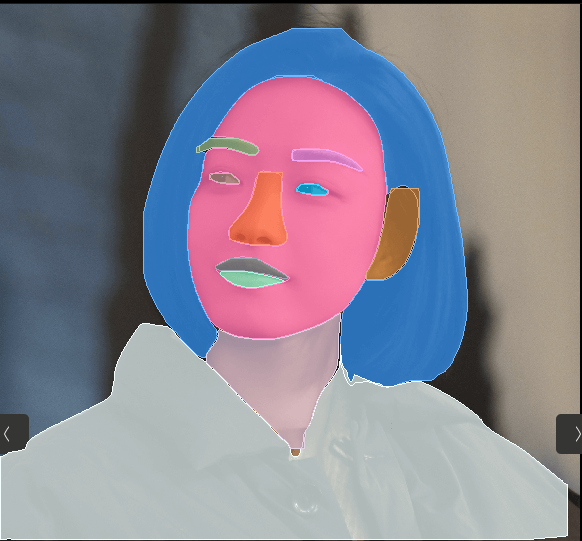
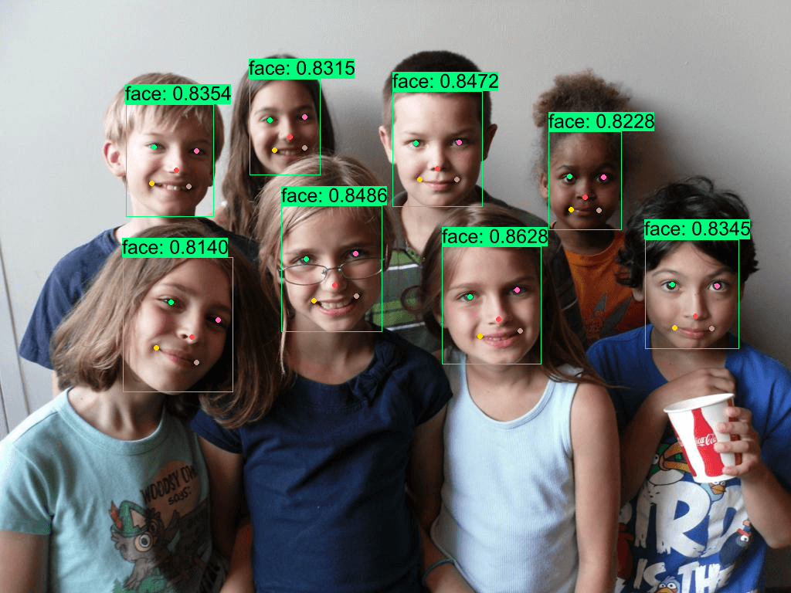
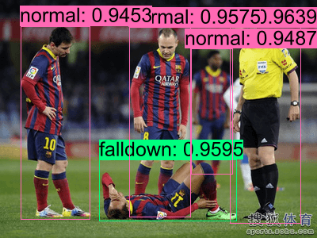
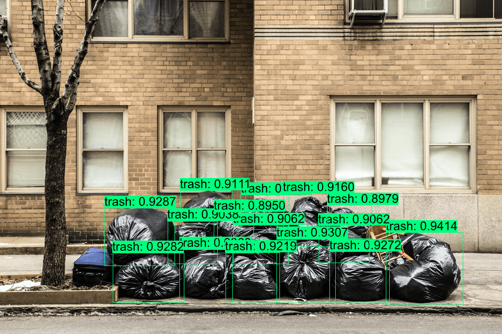

# usls

A Rust library integrated with **ONNXRuntime**, providing a collection of **Computer Vison** and **Vision-Language** models including [YOLOv5](https://github.com/ultralytics/yolov5), [YOLOv8](https://github.com/ultralytics/ultralytics), [YOLOv9](https://github.com/WongKinYiu/yolov9), [YOLOv10](https://github.com/THU-MIG/yolov10), [RTDETR](https://arxiv.org/abs/2304.08069), [CLIP](https://github.com/openai/CLIP), [DINOv2](https://github.com/facebookresearch/dinov2), [FastSAM](https://github.com/CASIA-IVA-Lab/FastSAM), [YOLO-World](https://github.com/AILab-CVC/YOLO-World), [BLIP](https://arxiv.org/abs/2201.12086), [PaddleOCR](https://github.com/PaddlePaddle/PaddleOCR), [Depth-Anything](https://github.com/LiheYoung/Depth-Anything), [MODNet](https://github.com/ZHKKKe/MODNet) and others.

## Recently Updated


|        YOLOv8-Obb         |
| :----------------------------: |
||


|        Depth-Anything         |
| :----------------------------: |
||


|        Portrait Matting         |
| :----------------------------: |
||


|        YOLOP-v2          |             Face-Parsing             |               Text-Detection           |  
| :----------------------------: | :------------------------------: |  :------------------------------: |
||  |  |


- 2024/06/30: **Accelerate model pre-processing and post-processing using SIMD**. YOLOv8-seg post-processing (~120ms => ~20ms), Depth-Anything post-processing (~23ms => ~2ms).
  


## Supported Models

|                               Model                               |         Task / Type         |         Example         | CUDA<br />f32 | CUDA<br />f16 |     TensorRT<br />f32     |     TensorRT<br />f16     |
| :---------------------------------------------------------------: | :-------------------------: | :----------------------: | :-----------: | :-----------: | :------------------------: | :-----------------------: |
|       [YOLOv8-obb](https://github.com/ultralytics/ultralytics)       |  Oriented Object Detection  |   [demo](examples/yolov8)   |      ✅      |      ✅      |             ✅             |            ✅            |
|    [YOLOv8-detection](https://github.com/ultralytics/ultralytics)    |      Object Detection      |   [demo](examples/yolov8)   |      ✅      |      ✅      |             ✅             |            ✅            |
|      [YOLOv8-pose](https://github.com/ultralytics/ultralytics)      |     Keypoint Detection     |   [demo](examples/yolov8)   |      ✅      |      ✅      |             ✅             |            ✅            |
| [YOLOv8-classification](https://github.com/ultralytics/ultralytics) |       Classification       |   [demo](examples/yolov8)   |      ✅      |      ✅      |             ✅             |            ✅            |
|  [YOLOv8-segmentation](https://github.com/ultralytics/ultralytics)  |    Instance Segmentation    |   [demo](examples/yolov8)   |      ✅      |      ✅      |             ✅             |            ✅            |
|            [YOLOv9](https://github.com/WongKinYiu/yolov9)            |      Object Detection      |   [demo](examples/yolov9)   |      ✅      |      ✅      |             ✅             |            ✅            |
|            [YOLOv10](https://github.com/THU-MIG/yolov10)            |      Object Detection      |   [demo](examples/yolov10)   |      ✅      |      ✅      |             ✅             |            ✅            |
|             [RT-DETR](https://arxiv.org/abs/2304.08069)             |      Object Detection      |   [demo](examples/rtdetr)   |      ✅      |      ✅      |             ✅             |            ✅            |
|         [FastSAM](https://github.com/CASIA-IVA-Lab/FastSAM)         |    Instance Segmentation    |  [demo](examples/fastsam)  |      ✅      |      ✅      |             ✅             |            ✅            |
|        [YOLO-World](https://github.com/AILab-CVC/YOLO-World)        |      Object Detection      | [demo](examples/yolo-world) |      ✅      |      ✅      |             ✅             |            ✅            |
|         [DINOv2](https://github.com/facebookresearch/dinov2)         |   Vision-Self-Supervised   |   [demo](examples/dinov2)   |      ✅      |      ✅      |             ✅             |            ✅            |
|                [CLIP](https://github.com/openai/CLIP)                |       Vision-Language       |    [demo](examples/clip)    |      ✅      |      ✅      | ✅ visual<br />❌ textual | ✅ visual<br />❌ textual |
|              [BLIP](https://github.com/salesforce/BLIP)              |       Vision-Language       |    [demo](examples/blip)    |      ✅      |      ✅      | ✅ visual<br />❌ textual | ✅ visual<br />❌ textual |
|                [DB](https://arxiv.org/abs/1911.08947)                |       Text Detection       |     [demo](examples/db)     |      ✅      |      ✅      |             ✅             |            ✅            |
|               [SVTR](https://arxiv.org/abs/2205.00159)               |      Text Recognition      |    [demo](examples/svtr)    |      ✅      |      ✅      |             ✅             |            ✅            |
| [RTMO](https://github.com/open-mmlab/mmpose/tree/main/projects/rtmo) |     Keypoint Detection     |    [demo](examples/rtmo)    |      ✅      |      ✅      |             ❌             |            ❌            |
|             [YOLOPv2](https://arxiv.org/abs/2208.11434)             | Panoptic Driving Perception |   [demo](examples/yolop)   |      ✅      |      ✅      |             ✅             |            ✅            |
|    [YOLOv5-classification](https://github.com/ultralytics/yolov5)    |      Object Detection      |   [demo](examples/yolov5)   |      ✅      |      ✅      |             ✅             |            ✅            |
|     [YOLOv5-segmentation](https://github.com/ultralytics/yolov5)     |    Instance Segmentation    |   [demo](examples/yolov5)   |      ✅      |      ✅      |             ✅             |            ✅            |
|     [Depth-Anything](https://github.com/LiheYoung/Depth-Anything)     |    Monocular Depth Estimation    |   [demo](examples/depth-anything)   |      ✅      |      ✅      |             ❌             |            ❌            |
|     [MODNet](https://github.com/ZHKKKe/MODNet)     |    Image Matting    |   [demo](examples/modnet)   |      ✅      |      ✅      |             ✅             |            ✅            |

## Solution Models


<details close>
<summary>Additionally, this repo also provides some solution models.</summary>

|                                                    Model                                                    |             Example             |                                     Result                                     |
| :---------------------------------------------------------------------------------------------------------: | :------------------------------: | :-----------------------------------------------------------------------------: |
| Lane Line Segmentation<br /> Drivable Area Segmentation<br />Car Detection<br />车道线-可行驶区域-车辆检测 | [demo](examples/yolov8-plastic-bag) |            |
|                                        Face Parsing<br />  人脸解析                                        |    [demo](examples/face-parsing)    |      |
|                          Text Detection<br />(PPOCR-det v3, v4)<br />通用文本检测                          |         [demo](examples/db)         |              |
|                       Text Recognition<br />(PPOCR-rec v3, v4)<br />中英文-文本识别                       |        [demo](examples/svtr)        |                                                                                |
|                               Face-Landmark Detection<br />人脸 & 关键点检测                               |    [demo](examples/yolov8-face)    |      |
|                                       Head Detection<br />  人头检测                                       |    [demo](examples/yolov8-head)    |      |
|                                       Fall Detection<br />  摔倒检测                                       |  [demo](examples/yolov8-falldown)  |  |
|                                       Trash Detection<br />  垃圾检测                                       | [demo](examples/yolov8-plastic-bag) |    |

</details>

## Demo

```
cargo run -r --example yolov8   # yolov9, blip, clip, dinov2, svtr, db, yolo-world...
```

## Installation

check **[ort guide](https://ort.pyke.io/setup/linking)**

<details close>
<summary>For Linux or MacOS users</summary>

- Firstly, download from latest release from [ONNXRuntime Releases](https://github.com/microsoft/onnxruntime/releases)
- Then linking
  ```shell
  export ORT_DYLIB_PATH=/Users/qweasd/Desktop/onnxruntime-osx-arm64-1.17.1/lib/libonnxruntime.1.17.1.dylib
  ```

</details>

## Integrate into your own project
<details close>
<summary>Expand</summary>

#### 1. Add `usls` as a dependency to your project's `Cargo.toml`

```shell
usls = { git = "https://github.com/jamjamjon/usls", rev = "xxx"}
```

#### 2. Set `Options` and build model

```Rust
let options = Options::default()
    .with_model("../models/yolov8m-seg-dyn-f16.onnx");
let mut model = YOLO::new(options)?;
```

- If you want to run your model with TensorRT or CoreML

  ```Rust
  let options = Options::default()
      .with_trt(0) // using cuda by default
      // .with_coreml(0) 
  ```
- If your model has dynamic shapes

  ```Rust
  let options = Options::default()
      .with_i00((1, 2, 4).into()) // dynamic batch
      .with_i02((416, 640, 800).into())   // dynamic height
      .with_i03((416, 640, 800).into())   // dynamic width
  ```
- If you want to set a confidence level for each category

  ```Rust
  let options = Options::default()
      .with_confs(&[0.4, 0.15]) // class 0: 0.4, others: 0.15
  ```
- Go check [Options](src/options.rs) for more model options.

#### 3. Prepare inputs, and then you're ready to go

- Build `DataLoader` to load images

```Rust
let dl = DataLoader::default()
    .with_batch(model.batch.opt as usize)
    .load("./assets/")?;

for (xs, _paths) in dl {
    let _y = model.run(&xs)?;
}
```

- Or simply read one image

```Rust
let x = vec![DataLoader::try_read("./assets/bus.jpg")?];
let y = model.run(&x)?;
```

#### 4. Annotate and save results

```Rust
let annotator = Annotator::default().with_saveout("YOLOv8");
annotator.annotate(&x, &y);
```

#### 5. Get results
The inference outputs of provided models will be saved to `Vec<Y>`. 

```Rust
pub struct Y {
    probs: Option<Prob>,
    bboxes: Option<Vec<Bbox>>,
    keypoints: Option<Vec<Vec<Keypoint>>>,
    mbrs: Option<Vec<Mbr>>,
    polygons: Option<Vec<Polygon>>,
    texts: Option<Vec<String>>,
    masks: Option<Vec<Mask>>,
    embedding: Option<Embedding>,
}
```


- You can get detection bboxes with `y.bboxes()`:
  ```Rust
  let ys = model.run(&xs)?;
  for y in ys {
      // bboxes
      if let Some(bboxes) = y.bboxes() {
          for bbox in bboxes {
              println!(
                  "Bbox: {}, {}, {}, {}, {}, {}",
                  bbox.xmin(),
                  bbox.ymin(),
                  bbox.xmax(),
                  bbox.ymax(),
                  bbox.confidence(),
                  bbox.id(),
              )
          }
      }
  }
  ```
  More `Bbox` methods here: `src/ys/bbox.rs`

- Other tasks results can be found at: `src/ys/y.rs`


</details>
