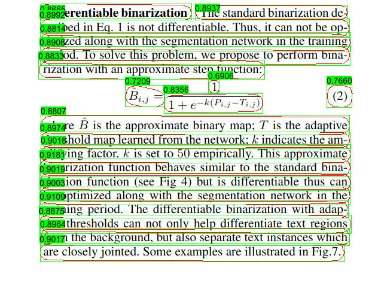

## Quick Start

```shell
cargo run -r --example db
```

## Or you can manully

### 1. Donwload ONNX Model

[ppocr-v3-db-dyn](https://github.com/jamjamjon/assets/releases/download/v0.0.1/ppocr-v3-db-dyn.onnx)
[ppocr-v4-db-dyn](https://github.com/jamjamjon/assets/releases/download/v0.0.1/ppocr-v4-db-dyn.onnx)

### 2. Specify the ONNX model path in `main.rs`

```Rust
let options = Options::default()
    .with_model("ONNX_PATH")    // <= modify this
    .with_profile(false);
```

### 3. Run

```bash
cargo run -r --example db
```

### Speed test

| Model           | Image size | TensorRT<br />f16 | TensorRT<br />f32 | CUDA<br />f32 |
| --------------- | ---------- | ----------------- | ----------------- | ------------- |
| ppocr-v3-db-dyn | 640x640    | 1.8585ms          | 2.5739ms          | 4.3314ms      |
| ppocr-v4-db-dyn | 640x640    | 2.0507ms          | 2.8264ms          | 6.6064ms      |

***Test on RTX3060***

## Results


