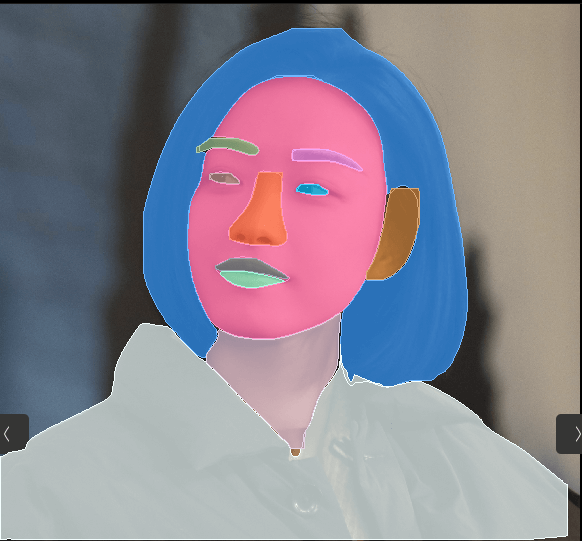

Using `YOLOv8-seg` model trained on `CelebAMask-HQ` for face-parsing.

## Quick Start

```shell
cargo run -r --example face-parsing
```

## Pretrained Model

- [face-parsing-dyn](https://github.com/jamjamjon/assets/releases/download/v0.0.1/face-parsing-dyn.onnx)
- [face-parsing-dyn-f16](https://github.com/jamjamjon/assets/releases/download/v0.0.1/face-parsing-dyn-f16.onnx)


## Datasets

- [CelebAMask-HQ](https://github.com/switchablenorms/CelebAMask-HQ/tree/master/face_parsing)

## YOLO Labels

- [Download Processed YOLO labels](https://github.com/jamjamjon/assets/releases/download/v0.0.1/CelebAMask-HQ-YOLO-Labels.zip)

- Or you can run Python script

	```Python
	import cv2
	import numpy as np
	from pathlib import Path
	from tqdm import tqdm


	mapping = {
	    'background': 0,
	    'skin': 1,
	    'nose': 2,
	    'eye_g': 3,
	    'l_eye': 4,
	    'r_eye': 5,
	    'l_brow': 6,
	    'r_brow': 7,
	    'l_ear': 8,
	    'r_ear': 9,
	    'mouth': 10,
	    'u_lip': 11,
	    'l_lip': 12,
	    'hair': 13,
	    'hat': 14,
	    'ear_r': 15,
	    'neck_l': 16,
	    'neck': 17,
	    'cloth': 18
	}


	def main():
		saveout_dir = Path("labels")
		if not saveout_dir.exists():
			saveout_dir.mkdir()
		else:
			import shutil
			shutil.rmtree(saveout_dir)
			saveout_dir.mkdir()


		image_list = [x for x in Path("CelebAMask-HQ-mask-anno/").rglob("*.png")]
		for image_path in tqdm(image_list, total=len(image_list)):
			image_gray = cv2.imread(str(image_path), cv2.IMREAD_GRAYSCALE)
			stem = image_path.stem
			name, cls_ = stem.split("_", 1)
			segments = cv2.findContours(image_gray, cv2.RETR_EXTERNAL, cv2.CHAIN_APPROX_SIMPLE)[0] 

			saveout = saveout_dir / f"{int(name)}.txt"
			with open(saveout, 'a+') as f:
				for segment in segments:
					line = f"{mapping[cls_]}"
					segment = segment / 512
					for seg in segment:
						xn, yn = seg[0]
						line += f" {xn} {yn}"
					f.write(line + "\n")


	if __name__ == "__main__":
	    main()

	```

## Results


