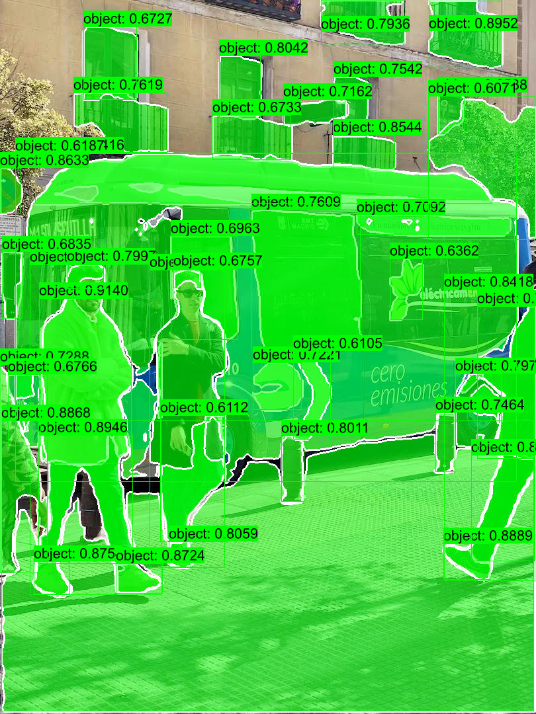

## Quick Start

```shell
cargo run -r --example fastsam
```

## Or you can manully


### 1.Donwload or export ONNX Model

- **Export**  

    ```bash
    pip install -U ultralytics
    yolo export model=FastSAM-s.pt format=onnx simplify dynamic
    ```

- **Download**  

    [FastSAM-s-dyn-f16](https://github.com/jamjamjon/assets/releases/download/v0.0.1/FastSAM-s-dyn-f16.onnx)

### 2. Specify the ONNX model path in `main.rs`

```Rust
let options = Options::default()
    .with_model("../models/FastSAM-s-dyn-f16.onnx")    // <= modify this
    .with_profile(false);
let mut model = YOLO::new(&options)?;
```

### 3. Then, run

```bash
cargo run -r --example fastsam
```

## Results


