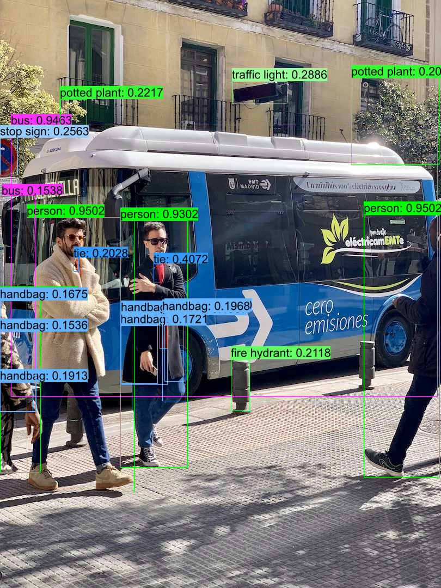

## Quick Start

```shell
cargo run -r --example rtdetr
```

## Or you can manully

### 1. Donwload or export ONNX Model

- Export

  ```bash
  pip install -U ultralytics
  yolo export model=rtdetr-l.pt format=onnx simplify dynamic opset=16
  ```
- Download

  [rtdetr-l-f16 model](https://github.com/jamjamjon/assets/releases/download/v0.0.1/rtdetr-l-f16.onnx)

### 2. Specify the ONNX model path in `main.rs`

```Rust
let options = Options::default()
    .with_model("ONNX_MODEL")    // <= modify this
    .with_saveout("RT-DETR");
```

### 3. Then, run

```bash
cargo run -r --example rtdetr
```

## Results


