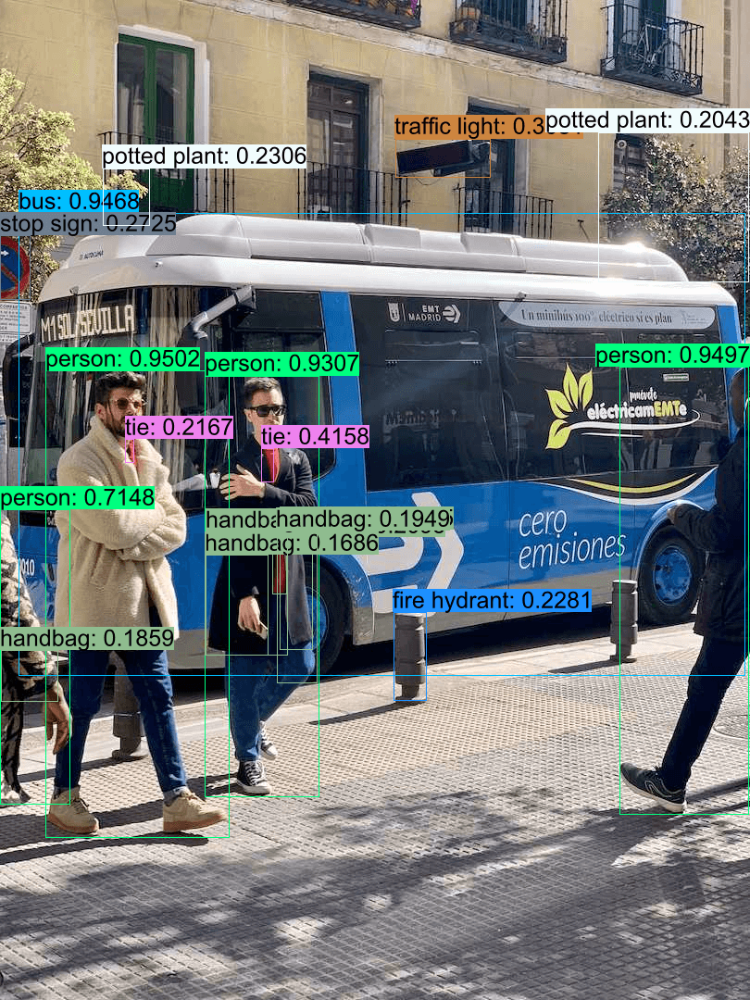

## Quick Start

```shell
cargo run -r --example rtdetr
```

## Donwload or export ONNX Model

- Export

  ```bash
  pip install -U ultralytics
  yolo export model=rtdetr-l.pt format=onnx simplify dynamic opset=16
  ```
- Download

  [rtdetr-l-f16 model](https://github.com/jamjamjon/assets/releases/download/v0.0.1/rtdetr-l-f16.onnx)

## Results


