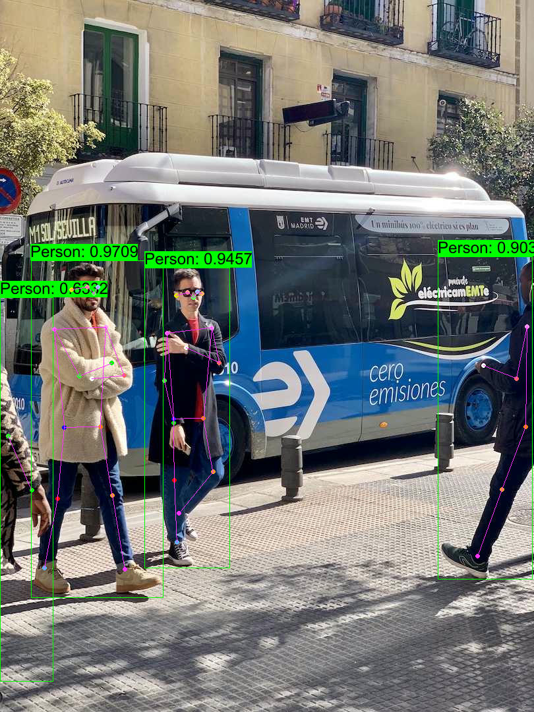

## Quick Start

```shell
cargo run -r --example rtmo
```

## Or you can manully

### 1. Donwload ONNX Model

[rtmo-s-dyn model](https://github.com/jamjamjon/assets/releases/download/v0.0.1/rtmo-s-dyn.onnx)  
[rtmo-m-dyn model](https://github.com/jamjamjon/assets/releases/download/v0.0.1/rtmo-m-dyn.onnx)  
[rtmo-l-dyn model](https://github.com/jamjamjon/assets/releases/download/v0.0.1/rtmo-l-dyn.onnx)  
[rtmo-s-dyn-f16 model](https://github.com/jamjamjon/assets/releases/download/v0.0.1/rtmo-s-dyn-f16.onnx)  
[rtmo-m-dyn-f16 model](https://github.com/jamjamjon/assets/releases/download/v0.0.1/rtmo-m-dyn-f16.onnx)  
[rtmo-l-dyn-f16 model](https://github.com/jamjamjon/assets/releases/download/v0.0.1/rtmo-l-dyn-f16.onnx)  


### 2. Specify the ONNX model path in `main.rs`

```Rust
let options = Options::default()
    .with_model("ONNX_MODEL")    // <= modify this
```

### 3. Then, run

```bash
cargo run -r --example rtdetr
```

## Results


