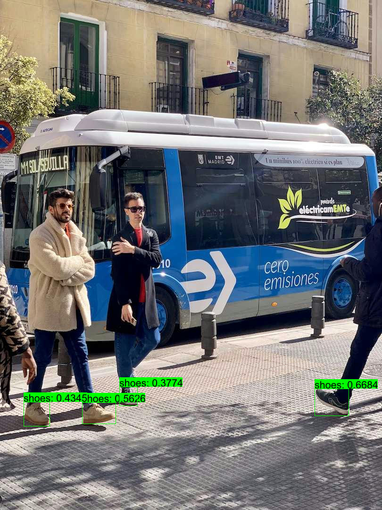

## Quick Start

```shell
cargo run -r --example yolo-world
```

## Or you can manully

### 1. Donwload or Export ONNX Model

- Download

  [yolov8s-world-v2-shoes](https://github.com/jamjamjon/assets/releases/download/v0.0.1/yolov8s-world-v2-shoes.onnx)
- Or generate your own `yolo-world` model and then Export

  - Installation

  ```shell
  pip install -U ultralytics
  ```

  - Generate

  ```python
  from ultralytics import YOLO

  # Initialize a YOLO-World model
  model = YOLO('yolov8m-worldv2.pt')

  # Define custom classes
  model.set_classes(["shoes"])

  # Save the model with the defined offline vocabulary
  model.save("custom_yolov8m-world-v2.pt")
  ```

  - Export

  ```shell
  yolo export model=custom_yolov8m-world-v2.pt format=onnx simplify dynamic
  ```

### 2. Specify the ONNX model path in `main.rs`

```Rust
let options = Options::default()
    .with_model("ONNX_PATH");   // <= modify this
```

### 3. Then, run

```
cargo run -r --example yolo-world
```

## Results


