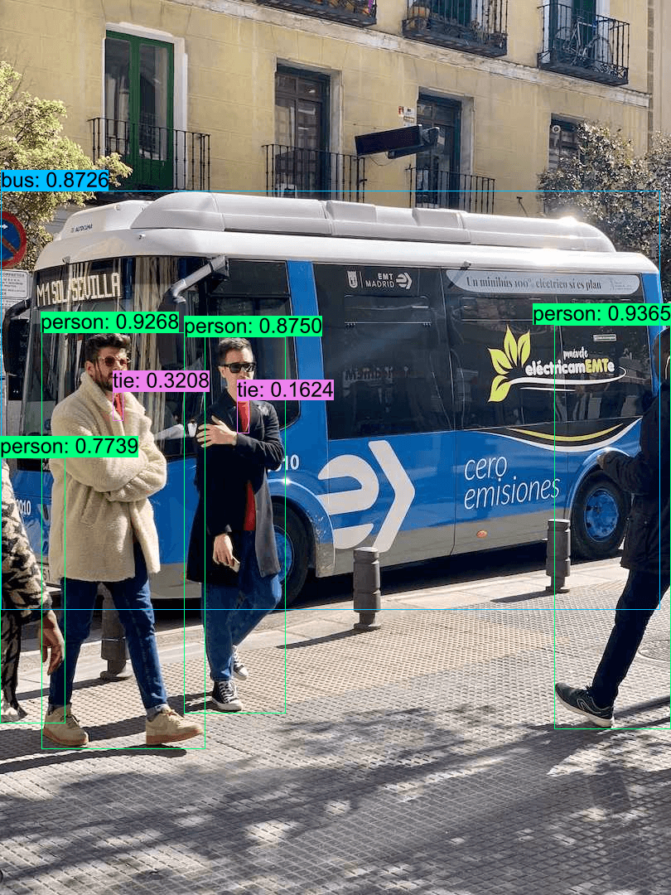
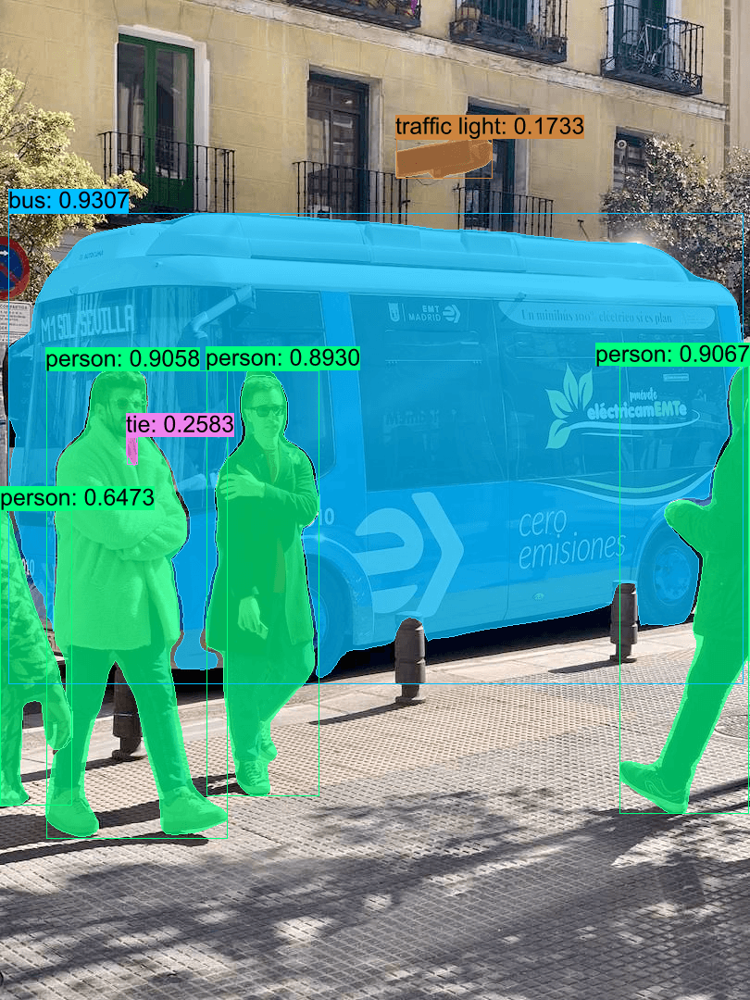
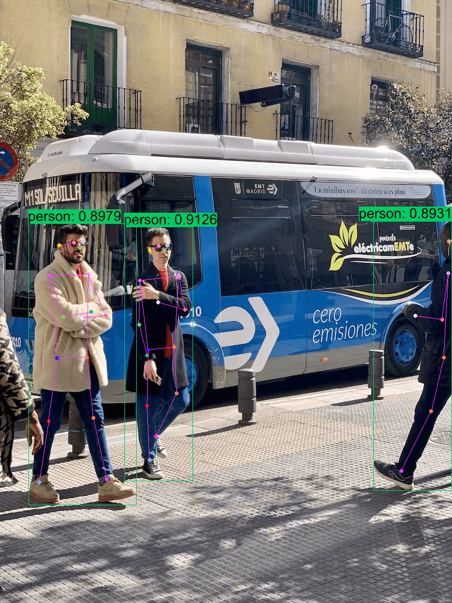
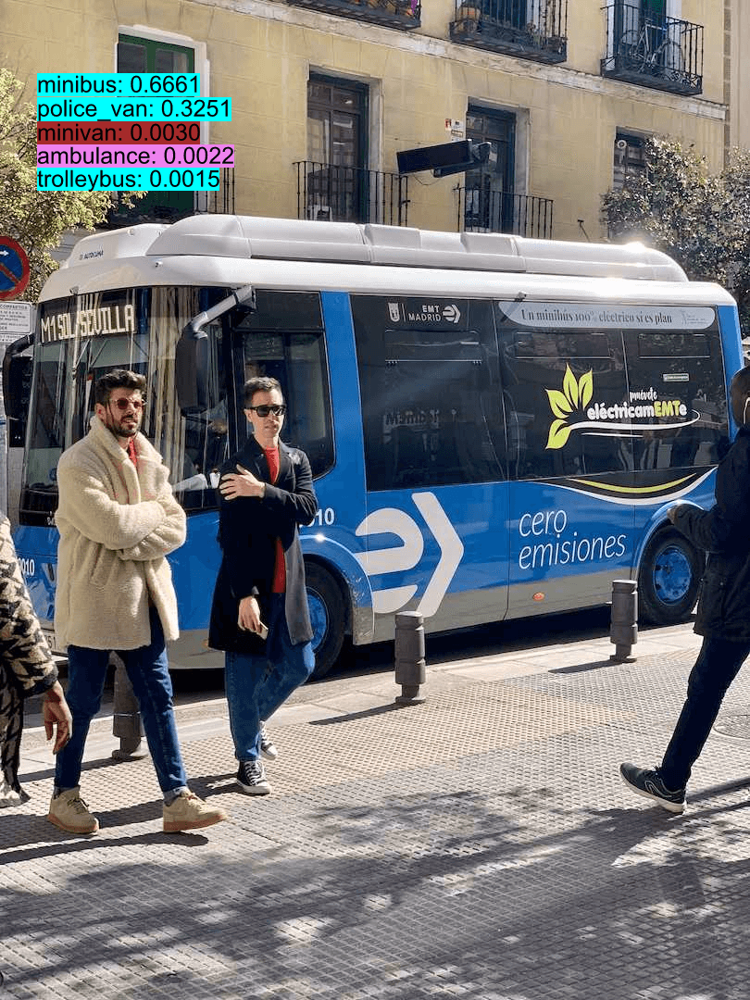
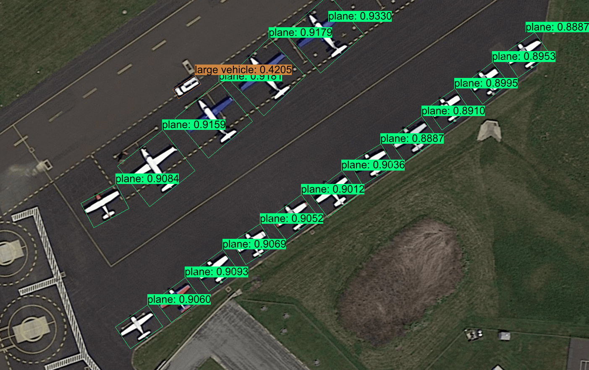
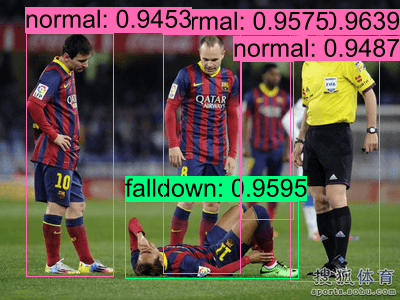
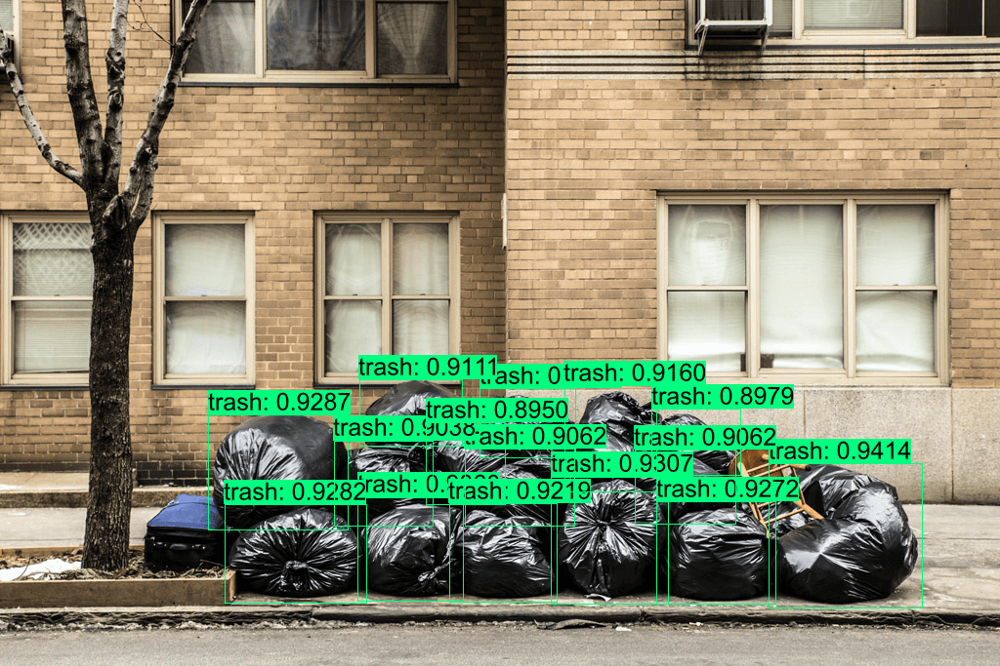
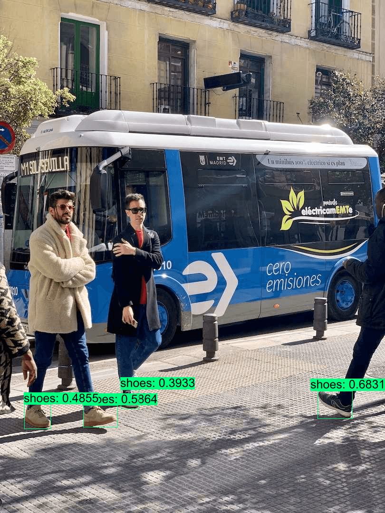
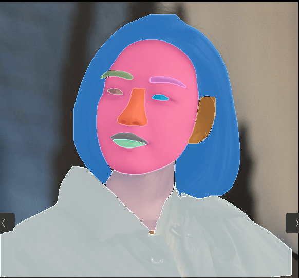
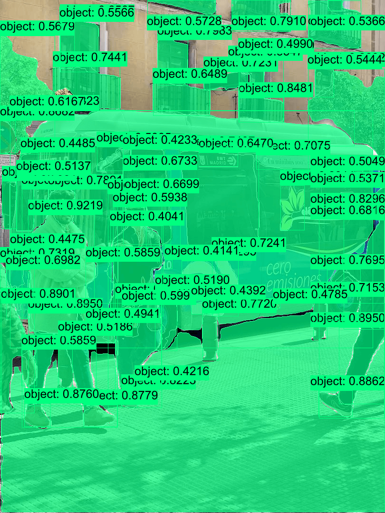

<h1 align='center'>YOLO-Series</h1>


|      Detection     |    Instance Segmentation   |   Pose     | 
| :---------------: | :------------------------: |:---------------: |
|   |  |  | 

|    Classification   |    Obb   |
| :------------------------: |:------------------------: |
| |

|    Head Detection   |    Fall Detection   | Trash Detection   |
| :------------------------: |:------------------------: |:------------------------: |
| ||

|    YOLO-World   |    Face Parsing   | FastSAM   |
| :------------------------: |:------------------------: |:------------------------: |
| ||


## Quick Start
```Shell

# Classify
cargo run -r --example yolo -- --task classify --ver v5  # YOLOv5 
cargo run -r --example yolo -- --task classify --ver v8  # YOLOv8 

# Detect
cargo run -r --example yolo -- --task detect --ver v5  # YOLOv5 
cargo run -r --example yolo -- --task detect --ver v6  # YOLOv6
cargo run -r --example yolo -- --task detect --ver v7  # YOLOv7
cargo run -r --example yolo -- --task detect --ver v8  # YOLOv8
cargo run -r --example yolo -- --task detect --ver v9  # YOLOv9
cargo run -r --example yolo -- --task detect --ver v10 # YOLOv10
cargo run -r --example yolo -- --task detect --ver rtdetr  # YOLOv8-RTDETR
cargo run -r --example yolo -- --task detect --ver v8 --model yolov8s-world-v2-shoes.onnx  # YOLOv8-world

# Pose
cargo run -r --example yolo -- --task pose --ver v8  # YOLOv8-Pose

# Segment
cargo run -r --example yolo -- --task segment --ver v5  # YOLOv5-Segment
cargo run -r --example yolo -- --task segment --ver v8  # YOLOv8-Segment
cargo run -r --example yolo -- --task segment --ver v8 --model FastSAM-s-dyn-f16.onnx  # FastSAM

# Obb
cargo run -r --example yolo -- --task obb --ver v8  # YOLOv8-Obb
```

<details close>
<summary>other options</summary>

`--source` to specify the input images  
`--model` to specify the ONNX model  
`--width --height` to specify the input resolution  
`--nc` to specify the number of model's classes  
`--plot` to annotate with inference results  
`--profile` to profile  
`--cuda --trt --coreml --device_id` to select device  
`--half` to use float16 when using TensorRT EP  

</details>


## YOLOs configs with `Options` 

<details open>
<summary>Use official YOLO Models</summary>

```Rust
let options = Options::default()
    .with_yolo_version(YOLOVersion::V5)  // YOLOVersion: V5, V6, V7, V8, V9, V10, RTDETR
    .with_yolo_task(YOLOTask::Classify)  // YOLOTask: Classify, Detect, Pose, Segment, Obb
    .with_model("xxxx.onnx")?;

```
</details>

<details open>
<summary>Cutomized your own YOLO model</summary>

```Rust
// This config is for YOLOv8-Segment 
use usls::{AnchorsPosition, BoxType, ClssType, YOLOPreds};

let options = Options::default()
    .with_yolo_preds(
        YOLOPreds {
            bbox: Some(BoxType::Cxcywh),
            clss: ClssType::Clss,
            coefs: Some(true),
            anchors: Some(AnchorsPosition::After),
            ..Default::default()
        }
    )
    .with_model("xxxx.onnx")?;
```
</details>

## Other YOLOv8 Solution Models

|          Model          |    Weights   | Datasets|
|:---------------------: | :--------------------------: | :-------------------------------: |
| Face-Landmark Detection |   [yolov8-face-dyn-f16](https://github.com/jamjamjon/assets/releases/download/v0.0.1/yolov8-face-dyn-f16.onnx)         | |
| Head Detection |   [yolov8-head-f16](https://github.com/jamjamjon/assets/releases/download/v0.0.1/yolov8-head-f16.onnx)         | |
| Fall Detection |   [yolov8-falldown-f16](https://github.com/jamjamjon/assets/releases/download/v0.0.1/yolov8-falldown-f16.onnx)          | |
| Trash Detection |   [yolov8-plastic-bag-f16](https://github.com/jamjamjon/assets/releases/download/v0.0.1/yolov8-plastic-bag-f16.onnx)         | |
| FaceParsing |  [face-parsing-dyn](https://github.com/jamjamjon/assets/releases/download/v0.0.1/face-parsing-dyn.onnx)  | [CelebAMask-HQ](https://github.com/switchablenorms/CelebAMask-HQ/tree/master/face_parsing)<br />[[Processed YOLO labels]](https://github.com/jamjamjon/assets/releases/download/v0.0.1/CelebAMask-HQ-YOLO-Labels.zip)[[Python Script]](https://github.com/jamjamjon/assets/releases/download/v0.0.1/CelebAMask-HQ-YOLO-Labels.zip) |


## Export ONNX Models


<details close>
<summary>YOLOv5</summary>
    
[Here](https://docs.ultralytics.com/yolov5/tutorials/model_export/)

</details>


<details close>
<summary>YOLOv6</summary>

[Here](https://github.com/meituan/YOLOv6/tree/main/deploy/ONNX)

</details>


<details close>
<summary>YOLOv7</summary>

[Here](https://github.com/WongKinYiu/yolov7?tab=readme-ov-file#export)

</details>

<details close>
<summary>YOLOv8</summary>
    
```Shell
pip install -U ultralytics

# export onnx model with dynamic shapes
yolo export model=yolov8m.pt format=onnx simplify dynamic
yolo export model=yolov8m-cls.pt format=onnx simplify dynamic
yolo export model=yolov8m-pose.pt format=onnx simplify dynamic
yolo export model=yolov8m-seg.pt format=onnx simplify dynamic
yolo export model=yolov8m-obb.pt format=onnx simplify dynamic

# export onnx model with fixed shapes
yolo export model=yolov8m.pt format=onnx simplify
yolo export model=yolov8m-cls.pt format=onnx simplify
yolo export model=yolov8m-pose.pt format=onnx simplify
yolo export model=yolov8m-seg.pt format=onnx simplify
yolo export model=yolov8m-obb.pt format=onnx simplify
```
</details>


<details close>
<summary>YOLOv9</summary>

[Here](https://github.com/WongKinYiu/yolov9/blob/main/export.py)

</details>

<details close>
<summary>YOLOv10</summary>

[Here](https://github.com/THU-MIG/yolov10#export)

</details>


