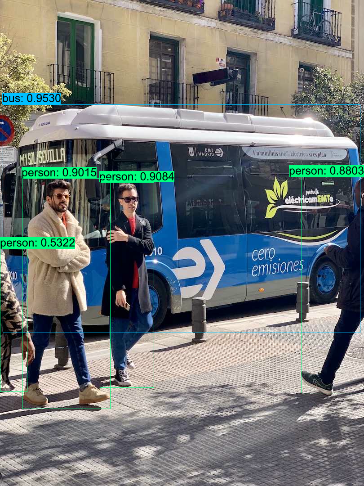

## Quick Start

```shell
cargo run -r --example yolov10
```

## Export ONNX Model

- **Export**

  ```shell
  # clone repo and install dependencies
  git clone https://github.com/THU-MIG/yolov10.git
  cd yolov10
  pip install -r requirements.txt

  # donwload `pt` weights
  wget https://github.com/THU-MIG/yolov10/releases/download/v1.1/yolov10n.pt

  # export ONNX model
  yolo export model=yolov10n.pt format=onnx opset=13 simplify dynamic
  ```

## Results


