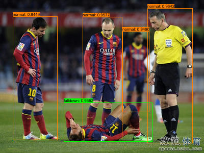

## Quick Start

```shell
cargo run -r --example yolov8-falldown
```

## Or you can manully

### 1.Donwload ONNX Model

[yolov8-falldown-f16](https://github.com/jamjamjon/assets/releases/download/v0.0.1/yolov8-falldown-f16.onnx)  

### 2. Specify the ONNX model path in `main.rs`

```Rust
let options = Options::default()
    .with_model("ONNX_PATH")    // <= modify this
    .with_profile(false);
let mut model = YOLO::new(&options)?
```

### 3. Then, run

```bash
cargo run -r --example yolov8-falldown
```

## Results


