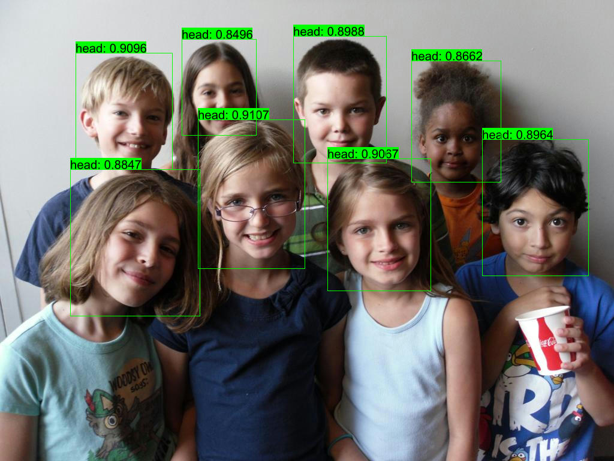

## Quick Start

```shell
cargo run -r --example yolov8-head
```

## ONNX Model

- [yolov8-head-f16](https://github.com/jamjamjon/assets/releases/download/v0.0.1/yolov8-head-f16.onnx)  


## Results


