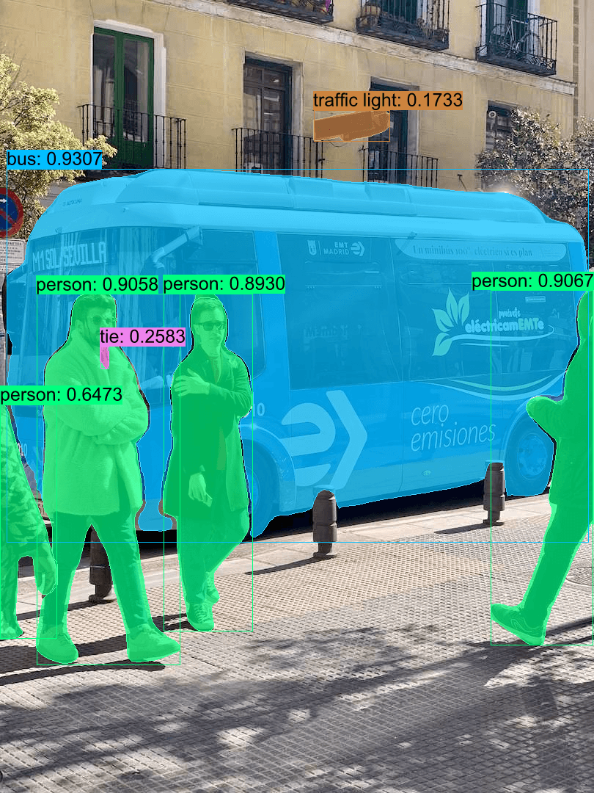
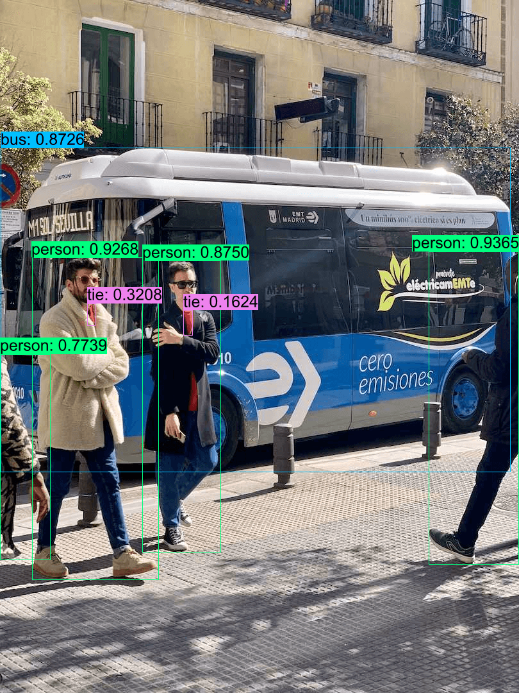
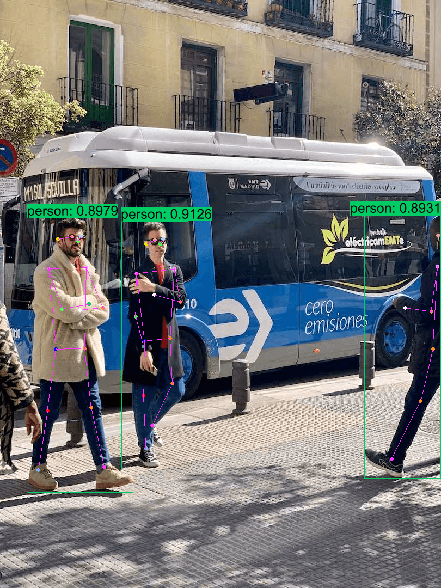

## Quick Start

```shell
cargo run -r --example yolov8
```

## Export `YOLOv8` ONNX Models

```bash
pip install -U ultralytics

# export onnx model with dynamic shapes
yolo export model=yolov8m.pt format=onnx simplify dynamic
yolo export model=yolov8m-cls.pt format=onnx simplify dynamic
yolo export model=yolov8m-pose.pt format=onnx simplify dynamic
yolo export model=yolov8m-seg.pt format=onnx simplify dynamic

# export onnx model with fixed shapes
yolo export model=yolov8m.pt format=onnx simplify
yolo export model=yolov8m-cls.pt format=onnx simplify
yolo export model=yolov8m-pose.pt format=onnx simplify
yolo export model=yolov8m-seg.pt format=onnx simplify
```

## Result

|         Task         | Annotated image       |
| :-------------------: | --------------------- |
| Instance Segmentation |   |
|    Classification    |   |
|       Detection       |   |
|         Pose         |  |
