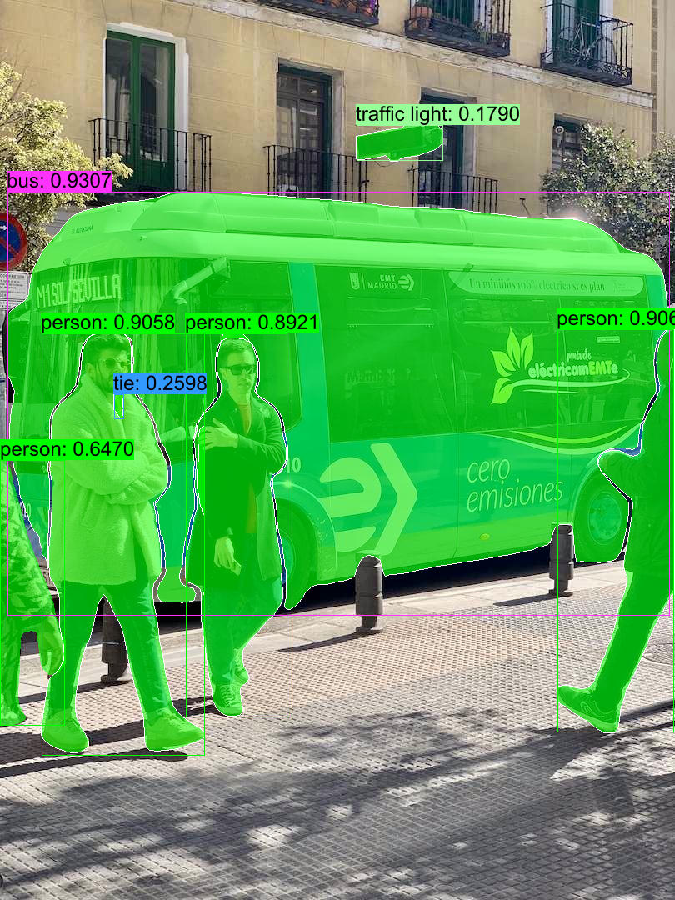

## Features

- Support `Classification`, `Segmentation`, `Detection`, `Pose(Keypoints)-Detection` tasks.
- Support `FP16` & `FP32` ONNX models.
- Support `CoreML`, `CUDA` and `TensorRT` execution provider to accelerate computation.
- Support dynamic input shapes(`batch`, `width`, `height`).
- Support dynamic confidence(`DynConf`) for each class in Detection task.

## Quick Start

```shell
cargo run -r --example yolov8
```

## Or you can manully

### 1. Export `YOLOv8` ONNX Models

```bash
pip install -U ultralytics

# export onnx model with dynamic shapes
yolo export model=yolov8m.pt format=onnx simplify dynamic
yolo export model=yolov8m-cls.pt format=onnx simplify dynamic
yolo export model=yolov8m-pose.pt format=onnx simplify dynamic
yolo export model=yolov8m-seg.pt format=onnx simplify dynamic

# export onnx model with fixed shapes
yolo export model=yolov8m.pt format=onnx simplify
yolo export model=yolov8m-cls.pt format=onnx simplify
yolo export model=yolov8m-pose.pt format=onnx simplify
yolo export model=yolov8m-seg.pt format=onnx simplify
```

### 2. Specify the ONNX model path in `main.rs`

```Rust
let options = Options::default()
    .with_model("ONNX_PATH")   // <= modify this
    .with_confs(&[0.4, 0.15]) // person: 0.4, others: 0.15
let mut model = YOLO::new(&options)?;
```

### 3. Then, run

```
cargo run -r --example yolov8
```

## Result

|         Task         | Annotated image       |
| :-------------------: | --------------------- |
| Instance Segmentation |   |
|    Classification    |   |
|       Detection       |   |
|         Pose         |  |
