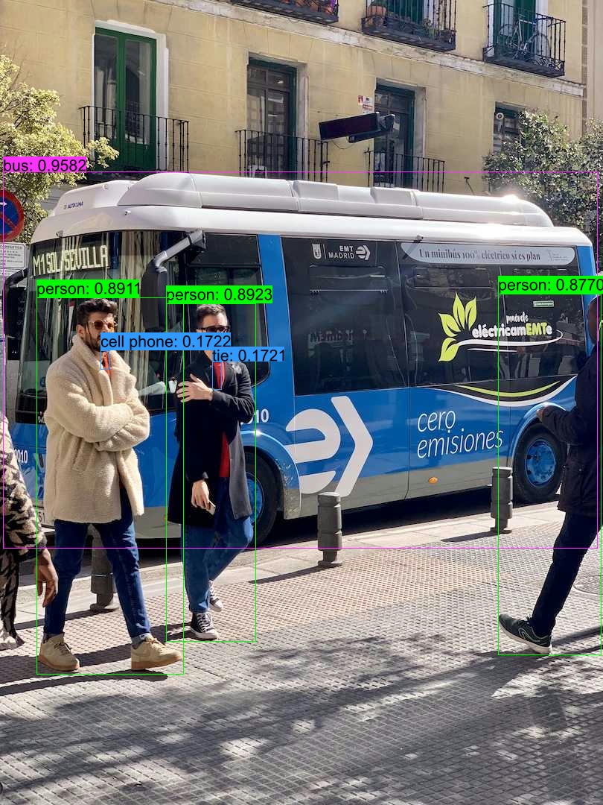

## Quick Start

```shell
cargo run -r --example yolov9
```

## Or you can manully

### 1. Donwload or Export ONNX Model

- **Download**

  [yolov9-c-dyn-fp16](https://github.com/jamjamjon/assets/releases/download/v0.0.1/yolov9-c-dyn-f16.onnx)
- **Export**

  ```shell
  # clone repo and install dependencies
  git clone https://github.com/WongKinYiu/yolov9.git
  cd yolov9
  pip install -r requirements.txt

  # donwload `pt` weights
  wget https://github.com/WongKinYiu/yolov9/releases/download/v0.1/yolov9-c.pt

  # export ONNX model
  python export.py --weights yolov9-c.pt --include onnx --simplify --dynamic
  ```

### 2. Specify the ONNX model path in `main.rs`

```Rust
let options = Options::default()
    .with_model("ONNX_PATH")   // <= modify this
    .with_saveout("YOLOv9");
```

### 3. Run

```
cargo run -r --example yolov9
```

## Results


